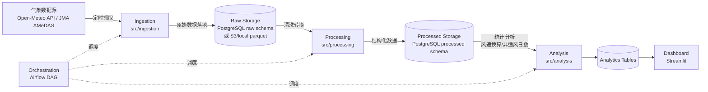

# 城市気候データETLパイプライン (Urban Climate Data ETL Pipeline)

> **本文档定位**:这是项目的开发规格说明书(working spec),用于指导 Claude Code 在本仓库中的开发工作。
> 完成MVP后,建议把顶部"项目简介"部分翻译成日语/英语,替换为面向招聘方的展示版README,
> 本文档剩余部分可移动到 `docs/DEVELOPMENT.md` 作为内部开发文档保留。

---

## 1. 项目简介

一个端到端的城市气候数据 ETL(Extract-Transform-Load)管道,自动抓取、清洗、存储、分析和可视化
城市气象观测数据(风速、风向、气温等),并复现"步行者高度風速换算比 R 值优化"这一分析逻辑
(灵感来自作者在东京大学的城市风环境研究:局地客观解析数据分析东京都市圈适风环境)。

项目目标是作为求职作品集,系统性展示数据工程(Data Engineering)三大核心能力:

- **Storage**:原始数据与处理后数据的分层存储设计
- **Processing**:数据清洗、转换、特征计算
- **Orchestration**:定时任务编排与管道自动化

同时保留作者的研究背景差异化优势(气象/城市气候领域知识 + 统计分析能力)。

---

## 2. 项目目标与非目标

### 2.1 目标(Goals)
- [ ] 实现从公开气象 API 自动抓取历史/实时观测数据的管道
- [ ] 建立分层数据存储(raw → processed → analytics)
- [ ] 实现风向-气温相关性分析、步行者高度风速换算与"非适风日数"计算逻辑
- [ ] 使用 Airflow(或轻量替代方案)实现管道的定时编排
- [ ] 提供一个简单的可视化 Dashboard 展示分析结果
- [ ] 容器化(Docker)+ 基础 CI(GitHub Actions:lint + test)
- [ ] 可选:部署到云端(AWS 或 GCP,与备考证书对齐)

### 2.2 非目标(Non-goals,避免范围蔓延)
- 不追求覆盖全日本所有观测站,先用 1~3 个代表性城市/站点验证管道
- 不在 MVP 阶段引入 Kafka 等流处理组件,先做批处理(batch),流处理作为后续扩展
- 不复刻论文级别的 CFD 仿真,本项目只做统计分析,不涉及 OpenFOAM 计算

---

## 3. 系统架构



---

## 4. 技术栈

| 层级 | 技术选型 | 备注 |
|---|---|---|
| 语言 | Python 3.11+ | |
| 数据抓取 | `httpx` / `requests` | |
| 数据处理 | `pandas`(或 `polars`,追求性能时) | |
| 数据库 | PostgreSQL 15(本地用 Docker) | 生产可换 RDS/Cloud SQL |
| ORM/访问层 | SQLAlchemy 2.x | |
| 编排 | Apache Airflow(Docker Compose 部署)| MVP阶段可先用 `APScheduler` 简化,后续再升级到 Airflow |
| 容器化 | Docker + docker-compose | |
| 可视化 | Streamlit | 轻量,适合个人项目 |
| 测试 | pytest | |
| CI | GitHub Actions | lint(ruff) + test |
| 云(可选) | AWS(S3/RDS/ECS)或 GCP(GCS/BigQuery/Cloud Run) | 与作者备考的 AWS/GCP 证书对齐,作为 Phase 5 扩展 |

---

## 5. 数据源

### 5.1 主数据源(MVP 使用,推荐)
**Open-Meteo Historical Weather API**(免费、无需 API Key、稳定)
- 文档:https://open-meteo.com/en/docs/historical-weather-api
- 可获取:10m 风速、风向、气温、气压、降水等小时级历史数据
- 优点:无认证门槛,适合快速跑通 MVP,且国际招聘方也能理解(不局限于日本本地数据源)

### 5.2 扩展数据源(体现日本本地领域知识,Phase 4+ 可选)
**気象庁(JMA)AMeDAS 观测数据**
- 公开页面:https://www.jma.go.jp/bosai/amedas/
- 需要额外处理(非标准 REST API,可能需要解析页面或使用第三方封装库)
- 加入这个数据源可以在面试中讲"如何处理非标准/非结构化数据源",是加分项,但不阻塞 MVP

---

## 6. 目录结构

```
urban-climate-etl/
├── README.md
├── pyproject.toml              # 依赖与项目元信息(推荐用 uv 或 poetry)
├── .env.example                # 环境变量模板(DB连接、API配置等)
├── docker-compose.yml          # 本地起 PostgreSQL + Airflow(可选)
├── src/
│   ├── ingestion/
│   │   ├── openmeteo_client.py     # 主数据源抓取
│   │   └── amedas_client.py        # 扩展数据源(Phase 4+)
│   ├── processing/
│   │   ├── clean.py                # 缺失值/异常值处理
│   │   └── transform.py            # 单位换算、字段标准化
│   ├── storage/
│   │   ├── models.py               # SQLAlchemy ORM 模型
│   │   └── db.py                   # 数据库连接与会话管理
│   ├── analysis/
│   │   ├── wind_comfort.py         # 风向-气温相关性、非适风日数计算
│   │   └── optimize_r.py           # R值优化搜索(核心差异化功能,见第8节)
│   ├── orchestration/
│   │   └── dags/
│   │       └── daily_pipeline.py   # Airflow DAG 定义
│   └── dashboard/
│       └── app.py                  # Streamlit 入口
├── tests/
│   ├── test_ingestion.py
│   ├── test_processing.py
│   └── test_analysis.py
├── data/
│   ├── raw/                    # 本地调试用,不进 git(加入 .gitignore)
│   └── processed/
└── docs/
    └── architecture.md         # 架构图与设计决策记录(ADR风格)
```

---

## 7. 开发路线图(按 Phase 推进,每个 Phase 结束应可独立跑通并 commit)

### Phase 0:项目脚手架
- [x] 初始化 `pyproject.toml`,配置 ruff + pytest
- [x] 写好 `docker-compose.yml`(PostgreSQL 服务)
- [x] `.env.example` 列出所有需要的环境变量
- [x] GitHub Actions 基础 CI(lint + test,先允许 test 为空跑通)

**验收标准**:`docker-compose up -d` 能起数据库,`pytest` 能跑(即使暂无用例)。

### Phase 1:MVP 批处理管道(Ingestion → Raw Storage)
- [x] 实现 `openmeteo_client.py`:按城市/日期范围抓取历史数据
- [x] 定义 `raw_observations` 表结构(见第9节数据模型)
- [x] 写入脚本,支持手动运行:`python -m src.ingestion.run --city tokyo --start 2024-01-01 --end 2024-12-31`
- [x] 单元测试覆盖 API 响应解析逻辑(mock HTTP 请求,不依赖真实网络)

**验收标准**:能手动跑一次,数据库里能看到写入的原始观测数据。

### Phase 2:数据处理(Processing → Processed Storage)
- [ ] 清洗:去重、缺失值处理、异常值(如风速为负数)过滤
- [ ] 转换:统一时区、单位标准化(如风速统一为 m/s)
- [ ] 写入 `processed_observations` 表
- [ ] 测试:构造包含脏数据的样本,验证清洗逻辑

**验收标准**:能从 raw 表跑一次 transform,processed 表数据干净可用。

### Phase 3:核心分析功能(体现研究背景差异化)
- [ ] 实现风向分类(8方位或16方位)与气温的相关性统计
- [ ] 实现步行者高度风速换算:`pedestrian_wind_speed = R * observed_wind_speed`(R 为可调参数)
- [ ] 实现"非适风日数"判定逻辑(强风日 + 弱风日阈值可配置)
- [ ] 实现 `optimize_r.py`:对 R 做网格搜索,找到使"强风非适风日数 + 弱风非适风日数"之和最小的 R 值
  - 这一模块是最能体现"从研究到工程转化能力"的部分,面试时的核心讲点
- [ ] 测试:用已知输入验证换算与判定逻辑的正确性

**验收标准**:给定一段时间序列数据,能输出最优 R 值及对应的非适风日数曲线(可以先用简单的
matplotlib 图或表格验证,不必等 Dashboard 做好)。

### Phase 4:编排自动化
- [ ] MVP 简化版:先用 `APScheduler` 或 cron 实现"每日自动抓取昨日数据"
- [ ] 进阶:迁移到 Airflow,写 `daily_pipeline.py` DAG,串联 ingestion → processing → analysis 三个 Task
- [ ] Airflow 本地用 Docker Compose 起(webserver + scheduler + postgres metadata db)

**验收标准**:DAG 能在 Airflow UI 里手动触发并成功跑完全流程,日志可查。

### Phase 5:可视化与部署(可选,时间允许再做)
- [ ] Streamlit Dashboard:展示风向玫瑰图、气温-风速散点图、R值优化结果曲线
- [ ] 云端部署:选 AWS 或 GCP 其中一个,把数据库换成托管服务,管道用 ECS/Cloud Run 跑
- [ ] 完善 README 顶部为面向招聘方的展示版本(附架构图截图、Dashboard 截图)

---

## 8. 核心差异化功能说明:R值优化(供 Claude Code 实现参考)

背景逻辑(简化自作者的研究课题,不要求完全还原论文精度,重点是展示分析思路):

1. 对每一天,计算实测风速通过换算比 R 得到的"步行者高度风速" = R × 实测风速
2. 定义强风阈值(如 > 5 m/s 记为强风不适日)与弱风阈值(如 < 1 m/s 记为弱风不适日)
3. 遍历 R 从某个范围(如 0.3~1.0,步长 0.01),统计每个 R 下的"强风不适日数 + 弱风不适日数"总和
4. 找到使该总和最小的 R 值,并可视化"非适风日数 vs R"曲线,通常应呈现出一个 U 形或类似的最优点

实现建议:`optimize_r.py` 输出一个 DataFrame(列:R, strong_wind_days, weak_wind_days, total_days),
供 Dashboard 直接读取绘图。

---

## 9. 数据模型(初版,可迭代)

**raw_observations**

| 字段 | 类型 | 说明 |
|---|---|---|
| id | serial | 主键 |
| station_id / city | varchar | 观测站或城市标识 |
| timestamp | timestamptz | 观测时间(UTC) |
| wind_speed | float | 原始风速(单位见 source 文档) |
| wind_direction | float | 风向角度(0-360) |
| temperature | float | 气温 |
| humidity | float | 湿度(可选) |
| source | varchar | 数据来源(如 "open-meteo") |
| ingested_at | timestamptz | 抓取入库时间 |

**processed_observations**

在 raw 基础上增加:标准化后的字段(单位统一、时区统一)、`wind_direction_octant`(8方位分类)等。

**analysis_r_optimization**

| 字段 | 类型 | 说明 |
|---|---|---|
| r_value | float | 试验的 R 值 |
| strong_wind_days | int | | 
| weak_wind_days | int | |
| total_uncomfortable_days | int | 优化目标 |
| period_start / period_end | date | 分析所用的时间窗口 |

---

## 10. 环境搭建

```bash
# 1. 克隆并进入项目
git clone <repo-url> && cd urban-climate-etl

# 2. 安装依赖(推荐 uv)
uv venv && uv pip install -r requirements.txt
# 或者用 poetry / pip,按 pyproject.toml 选择

# 3. 配置环境变量
cp .env.example .env
# 编辑 .env,填入数据库连接信息

# 4. 启动本地依赖服务
docker-compose up -d

# 5. 初始化数据库表结构
python -m src.storage.init_db

# 6. 跑一次手动抓取验证
python -m src.ingestion.run --city tokyo --start 2024-06-01 --end 2024-06-07
```

---

## 11. 致 Claude Code 的开发约定

- **按 Phase 顺序推进**,每个 Phase 完成后运行测试并 commit,不要跨 Phase 并行开发导致返工。
- 每个模块先写**最小可跑通版本**,再迭代优化,不要一开始就追求完美抽象。
- 数据库 schema 变更一律通过迁移脚本管理(推荐引入 `alembic`),不要手改数据库。
- 涉及真实网络请求的代码,单元测试必须 mock,不依赖真实 API 可用性。
- 如果某个 Phase 的技术选型需要调整(如放弃 Airflow 改用更轻量的方案),**先在 `docs/architecture.md`
  记录决策原因**,再动代码。
- 遇到本文档未覆盖、且会显著影响架构方向的决策(如更换数据库、更换编排工具),先向作者确认,
  不要自行决定后直接大范围重构。
- 完成每个 Phase 后,更新本 README 对应的 checkbox。

---

## 12. 参考资料

- Open-Meteo API 文档:https://open-meteo.com/en/docs
- 気象庁 AMeDAS:https://www.jma.go.jp/bosai/amedas/
- Apache Airflow 官方文档:https://airflow.apache.org/docs/
- Streamlit 文档:https://docs.streamlit.io/
