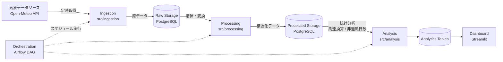
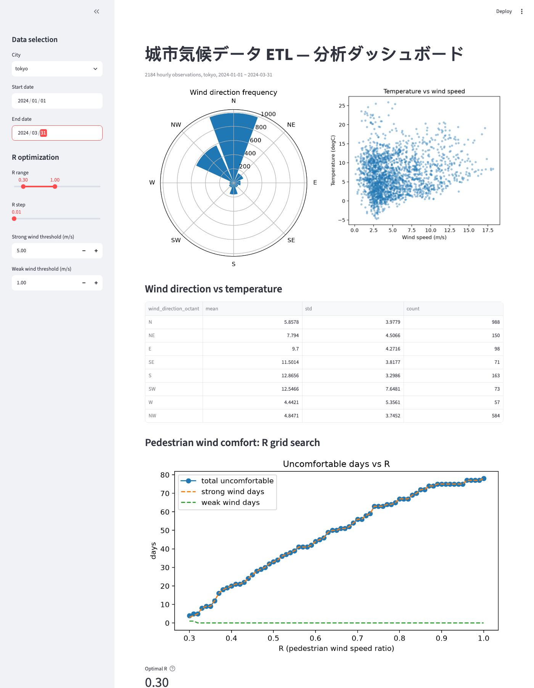

# 城市気候データ ETL パイプライン
### Urban Climate Data ETL Pipeline

気象データの収集から可視化までを一気通貫で自動化する、東京の都市風環境研究を出発点とした
データエンジニアリング・ポートフォリオです。

> **English summary**: An end-to-end ETL pipeline for urban climate data — automated
> ingestion, cleaning, storage, analysis, orchestration, and a dashboard — built around a
> pedestrian-level wind comfort analysis derived from the author's urban wind environment
> research at the University of Tokyo. See [Quick start](#クイックスタート) to run it, or
> [docs/DEVELOPMENT.md](docs/DEVELOPMENT.md) for the full technical spec.

---

## この作品で示したいこと

気象庁データ解析による都市風環境研究(東京大学)を、データエンジニアリングの実務スキルに
転化することを目的としたプロジェクトです。以下の3つの力を、実際に動くパイプラインで示します。

| 力 | このプロジェクトでの実装 |
|---|---|
| **Storage** | raw → processed → analytics の階層型データ設計(PostgreSQL) |
| **Processing** | 重複排除・欠損値処理・異常値フィルタ・単位/タイムゾーン標準化 |
| **Orchestration** | APScheduler(MVP)→ Airflow DAG(3タスクの依存関係付きパイプライン) |

加えて、研究背景を活かした差分化ポイントとして「歩行者高度風速換算比 R 値」の
グリッドサーチ最適化ロジックを実装しています(詳細は[こちら](#研究由来の差分化機能r値最適化))。

---

## アーキテクチャ



## 技術スタック

Python 3.11+ / httpx / pandas / SQLAlchemy 2.x / PostgreSQL 15 / Apache Airflow 3.x
(standalone) / APScheduler / Streamlit / matplotlib / pytest / ruff / Docker Compose /
GitHub Actions

---

## Dashboard プレビュー

2024年冬季(1〜3月)の東京データ。季節風による北/北西寄りの卓越風向、気温-風速の関係、
歩行者風快適性のR値グリッドサーチ結果を可視化しています。



---

## 研究由来の差分化機能:R値最適化

歩行者高度での風の体感は、地上観測点の風速をそのまま使わず、変換比 **R** を掛けて近似することが
多くあります(`pedestrian_wind_speed = R × observed_wind_speed`)。このRを

1. 強風閾値(例:5 m/s 超で「強風不適日」)
2. 弱風閾値(例:1 m/s 未満で「弱風不適日」)

の両方が最小になるように、0.3〜1.0の範囲でグリッドサーチして最適化するロジックを実装しました
(`src/analysis/optimize_r.py`)。研究で培った「気象データから体感指標を定量化する」視点を、
そのまま実装に落とし込んだ、このプロジェクトの中核機能です。

---

## クイックスタート

```bash
git clone <repo-url> && cd urban-climate-etl

python3 -m venv .venv && source .venv/bin/activate
pip install -e ".[dev]"

cp .env.example .env
docker-compose up -d postgres
python -m src.storage.init_db

# データを取得 → 処理 → 分析
python -m src.ingestion.run --city tokyo --start 2024-01-01 --end 2024-03-31
python -m src.processing.run --city tokyo --start 2024-01-01 --end 2024-03-31
python -m src.analysis.run --city tokyo --start 2024-01-01 --end 2024-03-31

# Dashboard
streamlit run src/dashboard/app.py
```

Airflow(Docker Compose でDAGを手動トリガーして確認する場合)やテストの実行方法は
[docs/DEVELOPMENT.md](docs/DEVELOPMENT.md#10-环境搭建) を参照してください。

---

## 開発の進め方(このリポジトリについて)

このプロジェクトは [Claude Code](https://claude.com/claude-code) と協働しながら、
Phase 0(スキャフォールド)→ Phase 1(取得)→ Phase 2(処理)→ Phase 3(分析)→
Phase 4(編成自動化)→ Phase 5(可視化)の順に段階的に構築しました。Phase 0〜4は完了、
Phase 5はDashboardまで完了(クラウドデプロイは未着手)しています。

- 詳しい開発仕様・データモデル・各Phaseの受け入れ基準: [docs/DEVELOPMENT.md](docs/DEVELOPMENT.md)
- 技術選定の変更とその理由(ADR形式): [docs/architecture.md](docs/architecture.md)
- セッションごとの作業ログ(何を・なぜ・どう検証したか): [docs/WORK_LOG.md](docs/WORK_LOG.md)
